# DALT-ANON-RESULTS-ANALYSIS

[](https://arxiv.org/abs/2609.28577)

Analysis of the listening test that measures the **phoneme intelligibility** of anonymized
speech with the DALT (*Diagnostic Alliteration Test*, Recommendation **ITU-T P.807**), and its
prediction by an **ensemble of 12 ASR models**.

The listening test itself (anonymized audio, item lists) is prepared in the
[DALT-ANON](https://github.com/VictorMenestrel/DALT-ANON) repository. This repository:

1. runs 12 ASR models on the same DALT items as the human listeners, the models being
   constrained to choose between the two words of each pair;
2. compares the ASR intelligibility with the human intelligibility (correlation, linear
   regression, Steiger-Williams tests between scoring methods and carrier phrase
   configurations, split-half reliability of the human ratings);
3. provides `take_the_test.py`, which **estimates the human intelligibility of a new
   anonymization system** from the ASR ensemble, without a listening test.


## Related repositories

- [Collected ratings](https://github.com/VictorMenestrel/DALT-for-Speech-Anonymizers): the anonymized ratings collected with this app.
- [Analysis and evaluation (this repo)](https://github.com/VictorMenestrel/DALT-ANON-RESULTS-ANALYSIS): analyze the ratings and evaluate the phoneme
  intelligibility of your own speech anonymizer with the equations defined in the paper.
- [Job preparation](https://github.com/VictorMenestrel/DALT-ANON): define the rating jobs and anonymize the reference
  recordings.

## Data

```
data/
  human_ratings.db                     human answers of the listening test (SQLite)
  ASR_ratings.db                       ASR answers, one table per model and carrier configuration
  audio/                               not versioned, see below
    samples/
      clean/English/test-data/           clean recordings
      clean/English/test_design.csv      metadata of the clean recordings
      <condition>/                       anonymized versions (B2_mcadams, B3_sttts, B4_nac, B5_asr_bn)
      your_anonymizer/                   the audio of your system, for take_the_test.py
    level_normalized_26dbfs_w_concat_carrier_phrase_2/
                                       versions with a 5-word carrier sentence, see concat_metadata.csv
    TTS_Qwen/                          TTS versions, with the carrier "please select the word <word>"
```

The audio files are not included in this repository. Download the content of
`data/audio/samples` from the `DALT-ANON-STUDY` repository (`DALT-ANON-STUDY/data/audio/samples`).

A script to download the content is provided in [data/audio/README.md](data/audio/README.md).

**Conditions.** The 2006 items rated by humans are spread over 6 conditions: `clean`,
`B2_mcadams`, `B3_sttts`, `B4_nac`, `B5_asr_bn` (VoicePrivacy Challenge baselines) and
`TTS_Qwen`. Each item is a DALT trial: a recorded word (the *present* word) and the other word
of its pair (the *absent* word), which differ by one consonant, initial or final (`test_type`),
along one phonetic feature (`Voicing`, `Nasality`, `Sustention`, `Sibilation`, `Graveness`,
`Compactness`).

**Human intelligibility.** Each answer is scored +1 if right and −1 if wrong, and averaged
per item: (right − wrong) / total, in [−1, 1]. Only the sessions that passed both the golden
and the trap questions are kept (`get_human_ratings` in [src/utils.py](src/utils.py)).

**ASR intelligibility.** For each item, every model chooses one of the two words of the
pair. Let `p` be the probability of the chosen word; since the choice is restricted to the
two words, p(present) + p(absent) = 1 for each model. The answers of the 12 models are
pooled and scored with one of 3 methods, where ± is + if the model
chose the present word and − otherwise:

| Metric                 | Definition                                                           |
|------------------------|----------------------------------------------------------------------|
| `HARD_VOTING`          | Σ(±1) / count: same scale as the human intelligibility               |
| `SOFT_VOTING`          | Σ(±p) / Σp: answers weighted by the confidence of the model          |
| `LOG_LIKELIHOOD_RATIO` | Σ log p(present) − Σ log p(absent) per item, averaged over the items |

The sums run over the 12 models (and over both carrier configurations when they are
pooled). Summing the log-probabilities of the models multiplies their likelihoods, i.e.
treats the models as independent judges of the same item.

## ASR models

| Model                                    | Backend in `src/models/` |
|------------------------------------------|--------------------------|
| `CohereLabs/cohere-transcribe-03-2026`   | `cohere.py`              |
| `facebook/wav2vec2-lv-60-espeak-cv-ft`   | `wav2vec2_espeak.py`     |
| `facebook/wav2vec2-xlsr-53-espeak-cv-ft` | `wav2vec2_espeak.py`     |
| `openai/whisper-large-v3`                | `whisper.py`             |
| `openai/whisper-large-v3-turbo`          | `whisper.py`             |
| `distil-whisper/distil-large-v3.5`       | `whisper.py`             |
| `nvidia/canary-qwen-2.5b`                | `canary_qwen.py`         |
| `Qwen/Qwen3-ASR-1.7B-hf`                 | `qwen_transformers.py`   |
| `Qwen/Qwen3-ASR-0.6B-hf`                 | `qwen_transformers.py`   |
| `ibm-granite/granite-4.0-1b-speech`      | `granite_ibm.py`         |
| `ibm-granite/granite-speech-4.1-2b`      | `granite_ibm.py`         |
| `ibm-granite/granite-speech-4.1-2b-plus` | `granite_ibm.py`         |

Every backend implements `load_model(model_name)` and
`generate_tokens_from_audio(audio_path, …, word_a, word_b, carrier_phrase)`, which constrains
the generation to the two words of the pair (optionally preceded by the carrier phrase) and
returns the chosen word with its probability. The models are downloaded from the Hugging Face
Hub on first use.

## Scripts

All scripts are run from the repository root, and `--help` lists their options.

### Estimate the intelligibility of your anonymizer: `src/take_the_test.py`

1. Anonymize the clean recordings of `data/audio/samples/clean/English/test-data` (the files
   without carrier phrase) with your system, **keeping the file names**.
2. Put the anonymized files in **`data/audio/samples/your_anonymizer`** (or any folder name
   you like, e.g. `data/audio/samples/my_system`).
3. Run:

   ```bash
   uv run src/take_the_test.py --audio-folder data/audio/samples/your_anonymizer --name your_anonymizer
   ```

The script maps the files to their DALT trial with `test_design.csv` (1152 trials: 12
recordings are used in two word pairs), runs the 12 ASR models, scores them with
`HARD_VOTING`, then maps the ASR score to an estimated human intelligibility with the linear
regressions fitted on the 6 conditions rated by humans:

| Aggregation             | Fitted on                         | Regression line            |
|-------------------------|-----------------------------------|----------------------------|
| a. all samples          | 6 conditions                      | y = 0.733863 x + 0.254060  |
| b. per test type        | 12 (condition, test type) pairs   | y = 0.756790 x + 0.236537  |
| c. per feature          | 36 (condition, feature) pairs     | y = 0.788272 x + 0.212755  |

The estimates are printed and saved to `data/take_the_test/<name>_estimates.csv`, on the
same scale as the human intelligibility ((right − wrong) / total). The ASR answers are stored
in `data/take_the_test/<name>.db`, one table per model: an interrupted run resumes with the
models not evaluated yet, `--skip-asr` only recomputes the estimates and `--overwrite` reruns
all the models. Running the 12 models on 1152 trials can take a while; a GPU is strongly
recommended.

### Run the ASR models: `src/run_eval.py`

Runs one or several models on the 2006 items of the listening test and writes the answers to
`data/ASR_ratings.db` (one table per model and carrier configuration, e.g.
`results_openai_whisper_large_v3_without_carrier_phrase`). The item lists are read from
`data/samples/*.csv` (generated by DALT-ANON).

```bash
uv run src/run_eval.py --models openai/whisper-large-v3 Qwen/Qwen3-ASR-0.6B-hf --carrier-phrase
```

The answers are written by batches of 500, so a crash only loses the last batch. An existing
table is never appended to: the script stops before starting, unless `--overwrite` is given.

### Correlation between ASR and human intelligibility: `src/plot_ASR_and_human_intelligibility_correlation.py`

Fits the linear regression of the human on the ASR intelligibility, prints R, R², the
regression line, the RMSE before (identity line) and after the regression, and checks the
residuals (Breusch-Pagan test for heteroscedasticity, Shapiro-Wilk test and QQ plot for
normality). `--merge` sets the columns defining one item, i.e. the aggregation level.

```bash
uv run src/plot_ASR_and_human_intelligibility_correlation.py --metric HARD_VOTING --merge condition feature
```

The regression lines used by `take_the_test.py` are obtained with `--metric HARD_VOTING
--carrier-phrase without` and `--merge condition`, `condition test_type` or
`condition feature`.

### Compare two ASR predictors: `src/compare_ASR_correlations_steiger_williams.py`

Steiger-Williams test (Williams' t) of the difference between two dependent correlations
with the human intelligibility, computed on the same items:

```bash
# Two metrics on the same carrier phrase configuration
uv run src/compare_ASR_correlations_steiger_williams.py metrics --metrics HARD_VOTING SOFT_VOTING

# Two carrier phrase configurations with the same metric
uv run src/compare_ASR_correlations_steiger_williams.py carrier-phrase --metric LOG_LIKELIHOOD_RATIO --carrier-phrases without both
```

### Reliability of the human ratings: `src/compute_split_half_human.py`

Split-half reliability: the ratings of each item are randomly split into two halves of 4,
the item means of both halves are correlated, and the correlation is corrected with the
Spearman-Brown formula. The split is repeated to give the mean reliability and its 95 %
interval.

```bash
uv run src/compute_split_half_human.py --n-iterations 100
```

## Repository layout

```
src/
  take_the_test.py                                 estimate the intelligibility of a new system
  run_eval.py                                      run the ASR models on the DALT items
  plot_ASR_and_human_intelligibility_correlation.py
  compare_ASR_correlations_steiger_williams.py
  compute_split_half_human.py
  utils.py                                         loading of the human and ASR ratings
  correlation/                                     shared code of the correlation scripts
    config.py                                        default settings (models, metric, items)
    data.py                                          loading, aggregation and merging of the ratings
    stats.py                                         regression, residual diagnostics, Steiger-Williams test
    plots.py                                         correlation and QQ plots
    cli.py                                           shared command line options
  models/                                          one backend per ASR model family
img/                                               figures, see Results
  human/                                           human listening test
  asr_vs_human/                                    ASR vs human correlation
  calibration/                                     calibration of the ASR models
  unused/                                          duplicates and older versions, not shown
```

## Installation

The project uses [uv](https://docs.astral.sh/uv/) and Python ≥ 3.13 (3.13 pinned in
`.python-version`).

```bash
uv sync
```

The scripts use paths relative to the repository root and must be run from it. A GPU is
recommended to run the ASR models.

## Results

### 1. Human intelligibility

**Error rate per condition.** Clean speech gives 4.1 % of errors and the TTS condition
4.9 %. Among the anonymization systems, NAC (B4) preserves intelligibility best (7.4 %),
followed by ASR-BN (B5, 10.9 %), McAdams (B2, 13.9 %) and STTTS (B3, 14.8 %). The TTS
condition has 4 times fewer trials, since it uses a single voice.

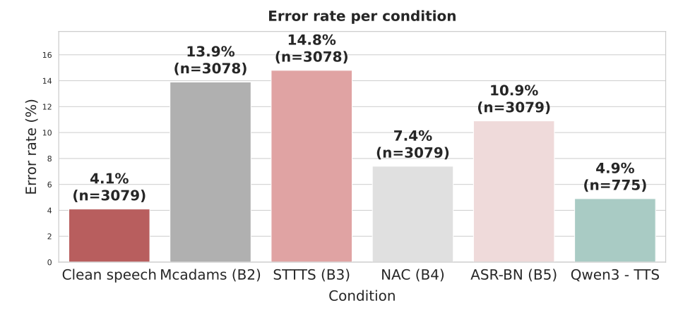

**Per phonetic feature.** The same data split by feature, grouped by condition and then by
feature. Graveness is the hardest feature in every condition (from 9.2 % for TTS Qwen
to 22.5 % for B3), while nasality and sibilation are the most robust.

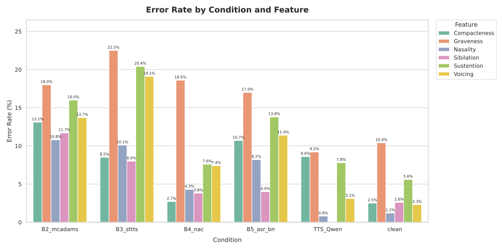
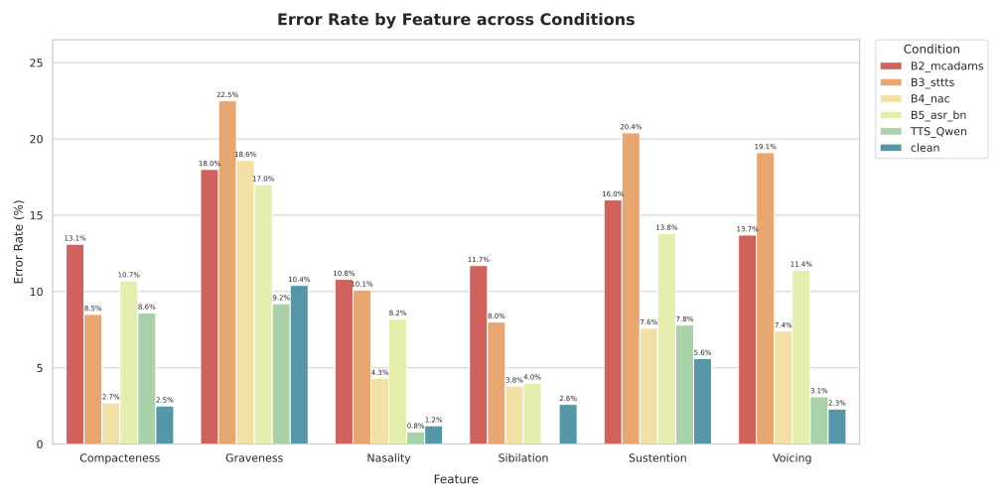

**Per tested consonant pair.** The errors concentrate on a few contrasts, such as f/θ in
every condition.

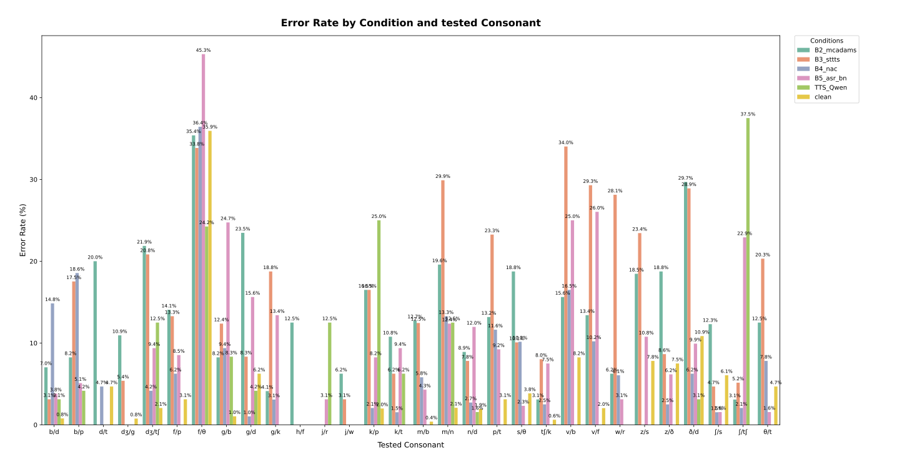

**Per test type.** Number of errors on the initial and on the final consonant: the final
consonant gives more errors in every condition.

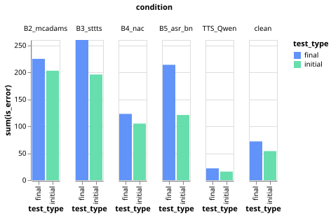

**Per talker gender.** The female talkers give more errors than the male talkers in most
conditions, especially B3 and B4; per feature, the gap is largest for voicing and
sustention.

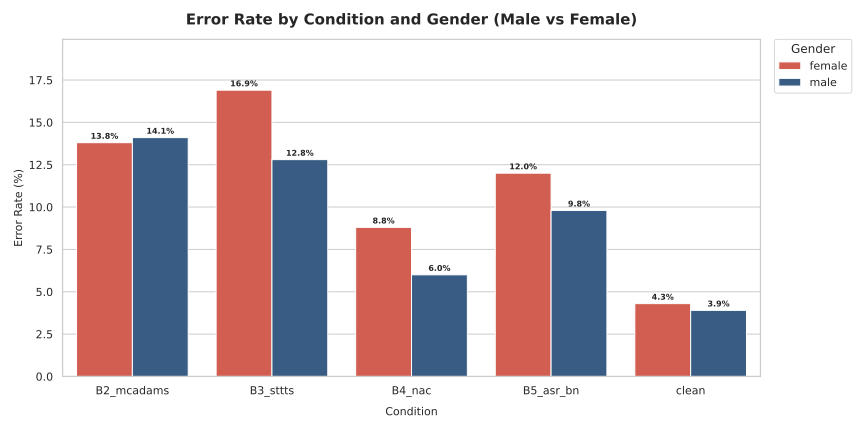
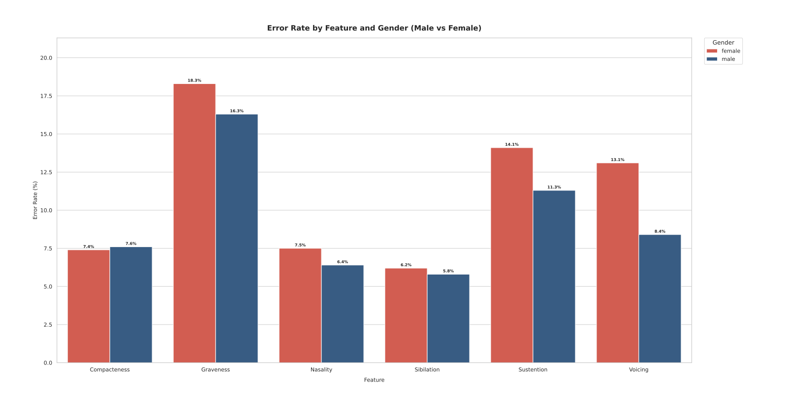

**Listener agreement.** Share of items per agreement level among the 8 or 9 listeners of
each item. All listeners agree on 82.3 % of the clean items but only on 52.1 % of the B2
items, where 14.3 % of the items are highly ambiguous.

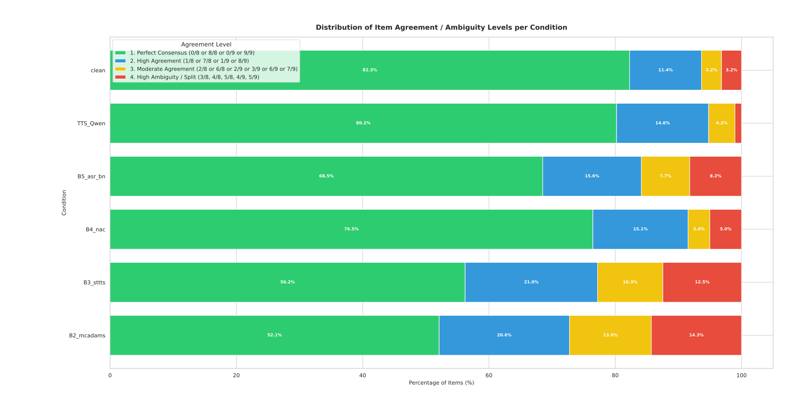

**Listening behavior.** Mean number of replays per trial: the listeners replay the B2 and
B3 audio about 4 times more often than clean speech (0.235 and 0.213 vs 0.055 replays per
trial), roughly following the error rates (only B2 and B3 swap places). The answer variance of an item also
correlates with its average completion time (Pearson r = 0.43) and replay count (r = 0.45):
ambiguous items take longer and are replayed more.

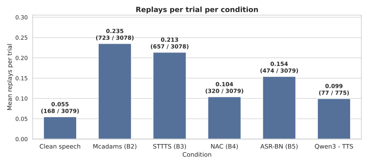
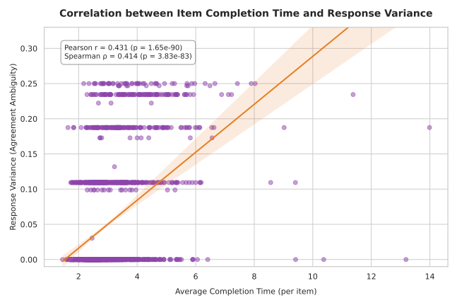
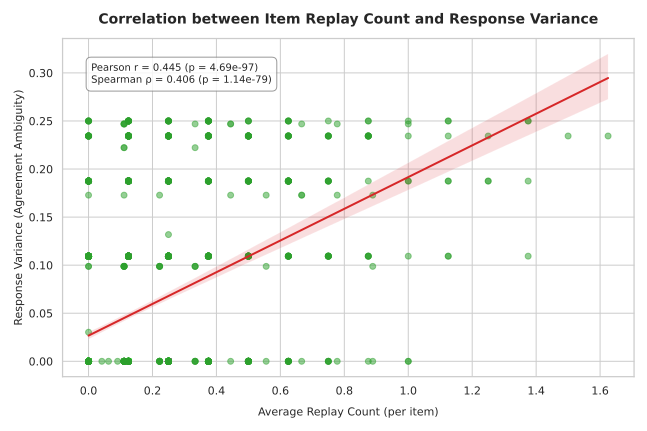

### 2. ASR vs human intelligibility

Linear regression of the human intelligibility on the ASR intelligibility (`SOFT_VOTING`,
12 models pooled), from the coarsest to the finest aggregation level
([plot script](src/plot_ASR_and_human_intelligibility_correlation.py)).
`take_the_test.py` uses the same approach with `HARD_VOTING`.

| Items                           | N    | Carrier phrase         | R    | R²   |
|---------------------------------|------|------------------------|------|------|
| condition                       | 6    | without                | 0.99 | 0.98 |
| condition × test type           | 12   | without                | 0.98 | 0.96 |
| condition × feature             | 36   | without                | 0.90 | 0.82 |
| condition × test type × feature | 72   | with and without pooled | 0.87 | 0.76 |
| item                            | 2006 | with and without pooled | 0.67 | 0.44 |

The ASR ensemble ranks the conditions almost perfectly, and the correlation decreases as the
items get finer and noisier. The points lie above the identity line (grey dashed line of
the last figure): the ASR ensemble slightly underestimates the human intelligibility, which
the linear mapping corrects.

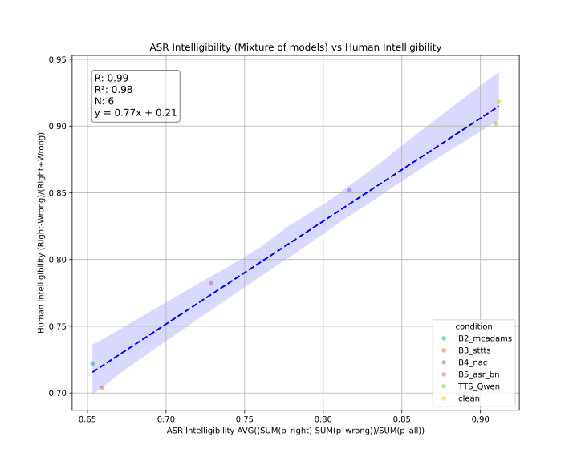
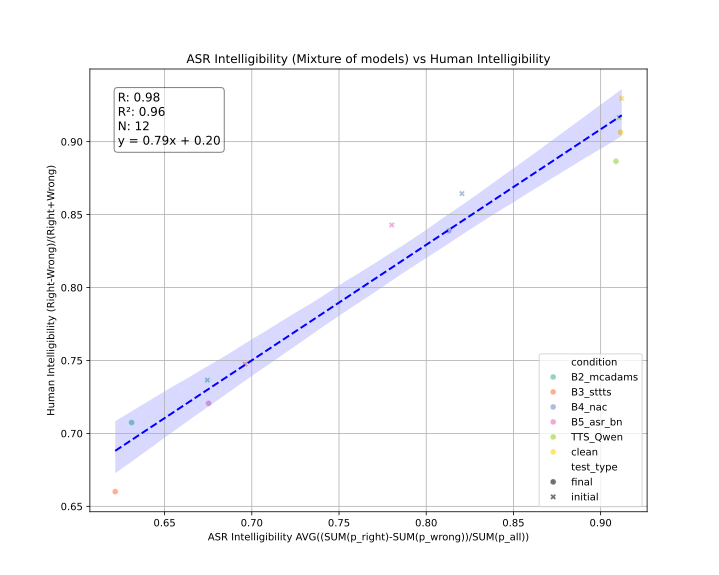
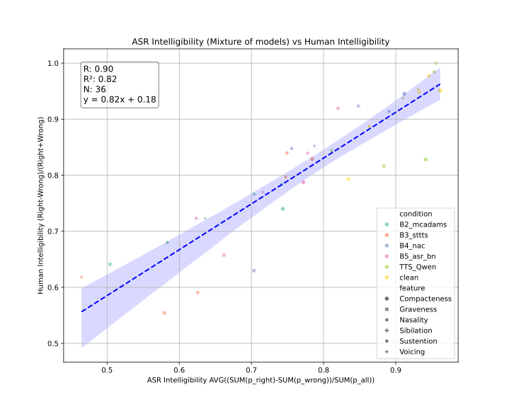

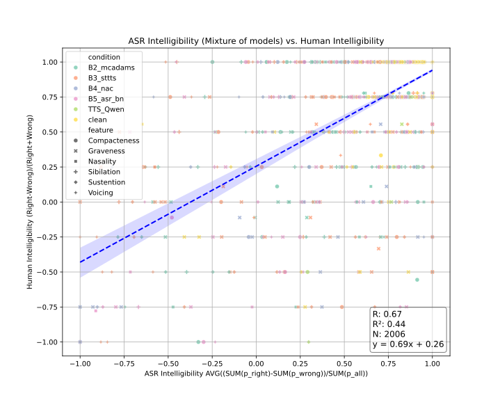

The three aggregation levels used by `take_the_test.py` on the same figure:

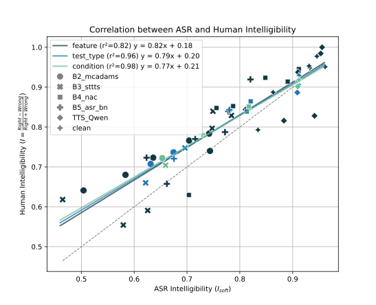

### 3. Calibration of the ASR models

Reliability diagrams (ECE): accuracy of the ASR answers per confidence bin, the ideal
calibration being the diagonal. Pooled over the 12 models, without carrier phrase, the
models are underconfident at low confidence and slightly overconfident at the highest
confidence. With the carrier phrase, the calibration is less regular. Per model, the
wav2vec2 models are underconfident, while the Granite Speech 4.1 models are the least
calibrated, especially with the carrier phrase.

| | Without carrier phrase | With carrier phrase |
|---|---|---|
| **Pooled** | 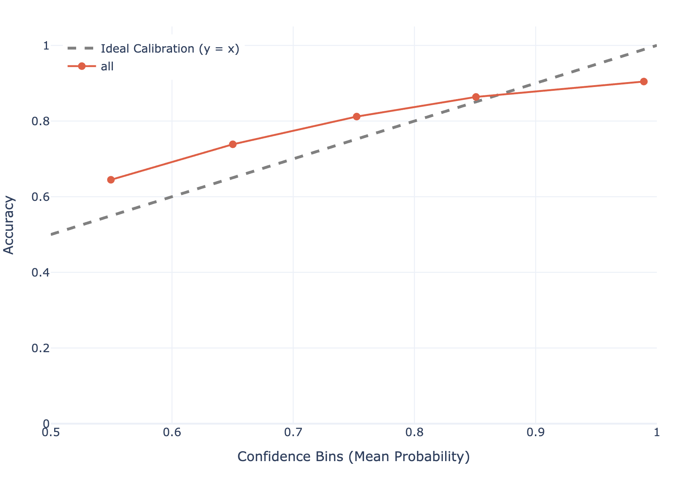 | 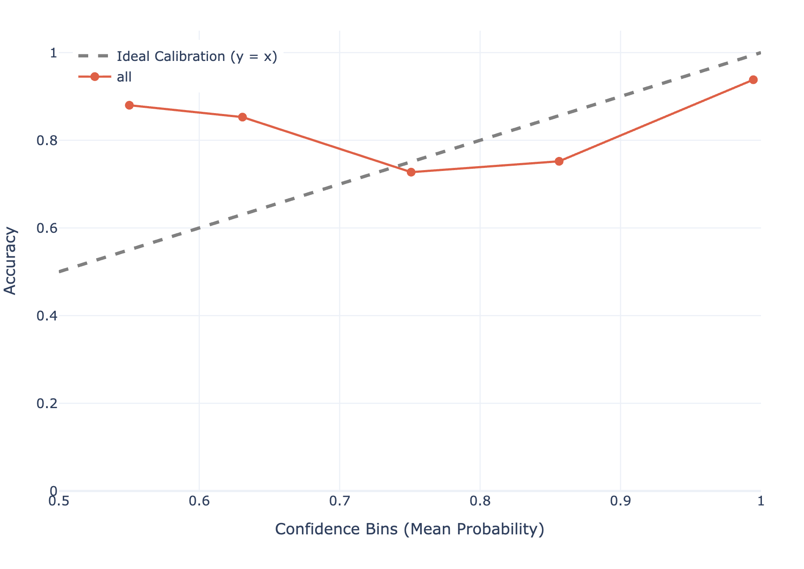 |
| **Per model** | 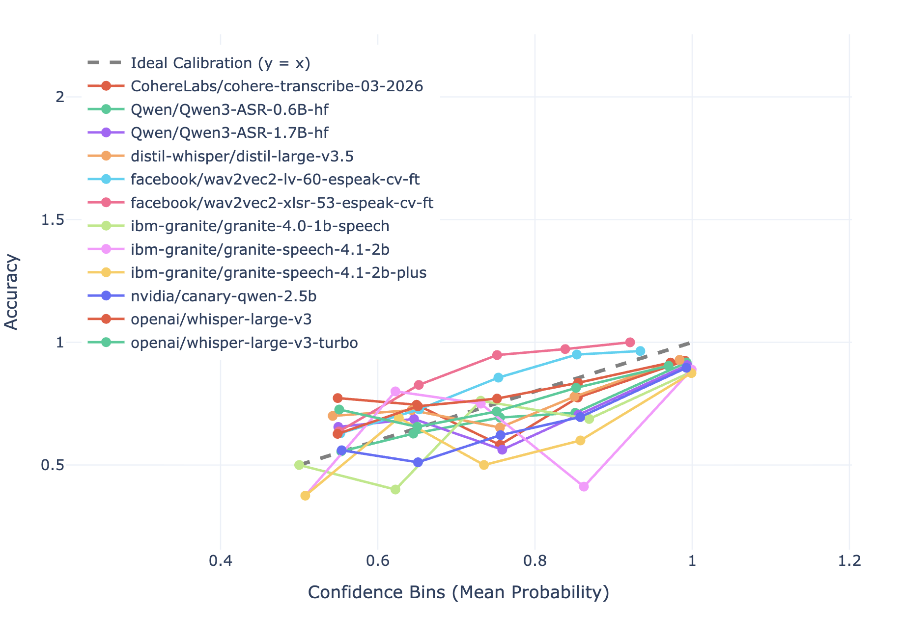 | 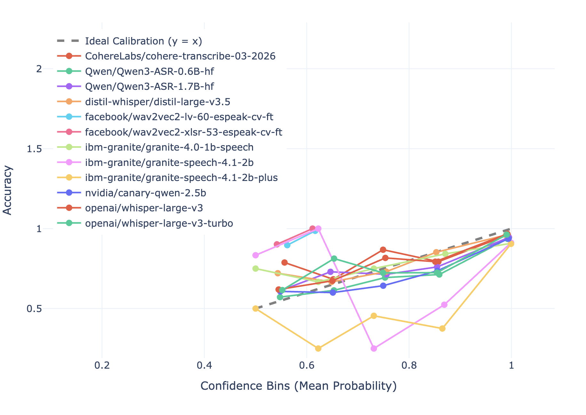 |

Both carrier phrase configurations pooled:

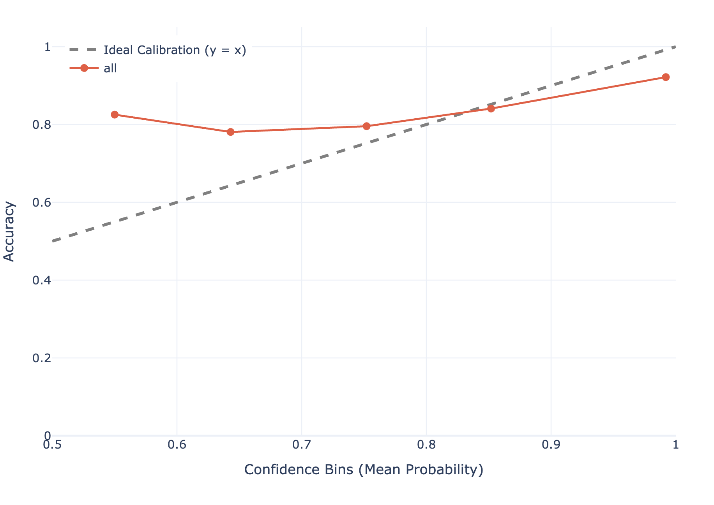

## License and credits

The source code is released under the [MIT license](LICENSE). The audio files are not
covered by the MIT license: they keep the licenses of their sources, described in
[data/audio/README.md](data/audio/README.md).

- **DALT test**: the word pairs and the test methodology come from Recommendation
  **ITU-T P.807** (02/2016), *Subjective test methodology for assessing speech
  intelligibility*, ITU Telecommunication Standardization Sector (ITU-T).
- **Anonymization conditions**: B2, B3, B4 and B5 are baselines of the
  [VoicePrivacy Challenge](https://www.voiceprivacychallenge.org/); the anonymized audio was
  produced in [DALT-ANON](https://github.com/VictorMenestrel/DALT-ANON), which credits the original code. The TTS condition uses
  [Qwen3-TTS](https://huggingface.co/Qwen/Qwen3-TTS-12Hz-1.7B-CustomVoice).
- **ASR models**: the 12 models listed above are not distributed with this repository; they
  are downloaded from the Hugging Face Hub and remain under the licenses given on their model
  cards.

## Citation

If you use this repository, please cite:

> V. Ménestrel, S. Möller, S. Ouni and D. Kolossa, "ASR ensembling for phoneme intelligibility
> evaluation of speech anonymizers", arXiv preprint arXiv:2609.28577, 2026.

```bibtex
@article{menestrel2026asr,
  title   = {{ASR} ensembling for phoneme intelligibility evaluation of speech anonymizers},
  author  = {M{\'e}nestrel, Victor and M{\"o}ller, Sebastian and Ouni, Slim and Kolossa, Dorothea},
  journal = {arXiv preprint arXiv:2609.28577},
  year    = {2026}
}
```
